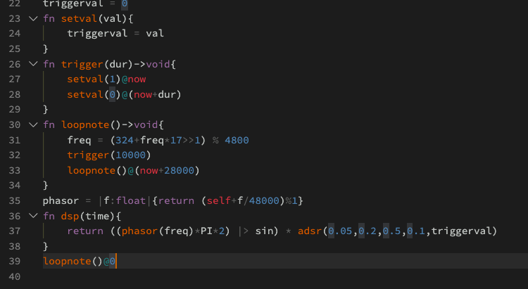

# mimium Visual Studio Code Extension

This is a language support extension of [mimium](https://github.com/tomoyanonymous/mimium) for VSCode.

- Syntax highlighting for mimium source files (which have `.mmm` extension)
- Download the latest binary from Github Release
- Run opening file from the command(Cmd+Shift+P => "Run opening file")

## Screenshot

## Known Issues

## Release Notes

### 1.1.0(2020-02-06)

Added new features:

 - downloading latest binary
 - executing currently opening .mmm file
### 1.0.0(2020-02-03)

Initial release

## License

MIT
