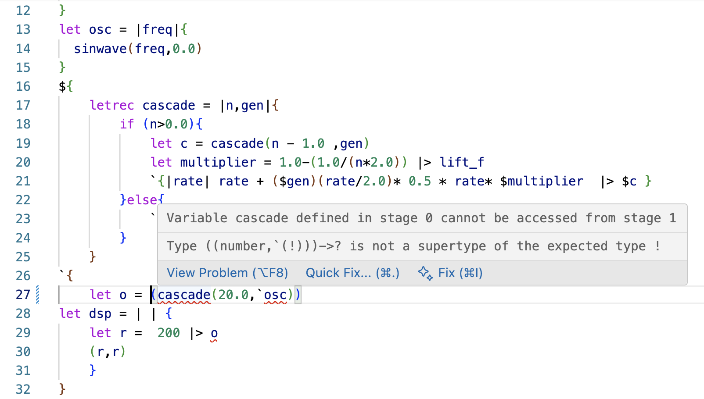

# mimium Visual Studio Code Extension

This is a language support extension of [mimium](https://github.com/tomoyanonymous/mimium-rs), an infrastructural programming languge.

This extension provides a syntax highlight for mimium source files (which have `.mmm` extension), and basic error reporting feature.

Also, this extension works as the easiest installer of mimium compiler and standard libraries. The extension automatically download the latest release from Github Release into `~/.mimium`. **To use enhanced highlighting support and error reporting feature, the language server needed to be installed. The server is installed together with the compiler(mimium-cli) by this extension.**

You can play opening mimium file on the editor, by the editor action button(right side of the file tabs) or the command palette (Cmd+Shift+P => "Run opening file").

## Screenshot

## Development

See [Development.md](Development.md).

## Release Notes

[Change Log](./CHANGELOG.md)

## License

[MIT](License.md)
